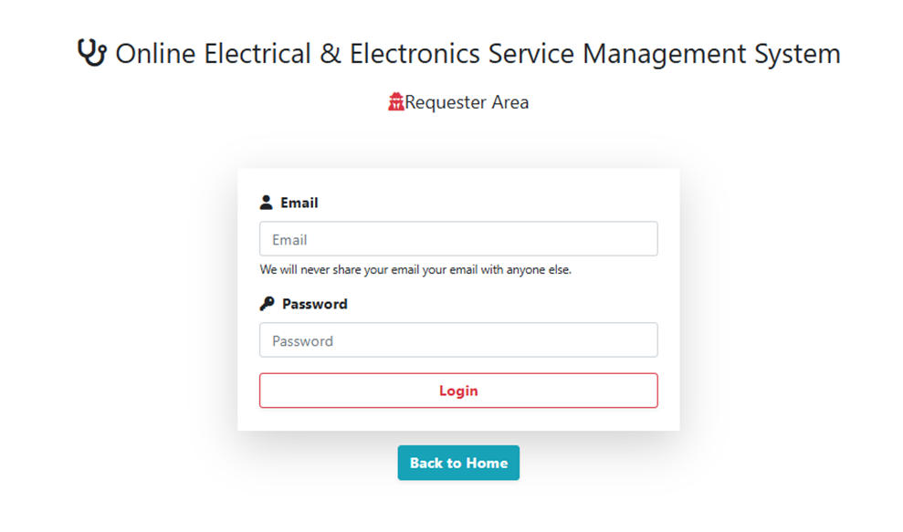

# Smart-Scrap-Management-System
A web application designed to simplify and digitize scrap collection. Users can schedule pickups online, and admins and drivers can manage the entire process digitally. This system improves efficiency, saves time, and promotes eco-friendly waste management.
• Developed a full-stack web-based scrap management system for 60+ users, enabling online pickup requests, real-time tracking, and automated notifications.
• Designed responsive UI with HTML, CSS, and JavaScript, built back-end with PHP, and integrated MySQL for efficient data management.
• Implemented Geocoding API for location validation, reducing scheduling errors by 40%, and added automated emails, eliminating 70% of manual status updates.
• Included driver safety modules such as daily vehicle pre-checks and incident reporting for accountability.
• Tech Stack: HTML, CSS, JavaScript, PHP, MySQL.

## Admin account features
1. Secure login and dashboard view of all requests and drivers
2. Manage drivers (add, edit, delete, set passwords)
3. Approve/reject requests and assign drivers.
4. Monitor driver status and updates.
5. Generate reports by date, driver, and request status.
6. Manage scrap price lists and recycler center details.
7. Track revenue, profit, and loss from scrap sales.
8. Manage users, content pages, and payment records.
9. Review incident reports and daily vehicle pre-checks.
10. See the report for components.
11. Receive notifications for new requests and driver updates.

## User Account Features
1. Sign up/login with secure credentials.
2. Submit new scrap pickup requests with details (address, scrap type, images, date/time, UPI-linked mobile).
3. Location validation using Geocoding API before request submission.
4. View request history and check live request status.
5. Receive automated email notifications on status updates.
6. Access payment receipts after scrap collection.
7. Manage profile and update credentials.

## Driver Account Features
1. Login with admin-assigned credentials

2. Dashboard showing assigned, in-progress, and completed requests

3. Update request status (On the Way, Completed, Rejected)

4. Notify users and admin on updates

5. Generate invoices (Cash/UPI, amount, remarks)

6. Submit daily vehicle pre-check reports (tires, lights, brakes, fluids, etc.)

7. Report trip incidents with details, location, and optional file upload

8. Manage profile and password updates

9. Receive notifications for new assignments

# Screenshots
## Admin side
### Dashboard

### LOGIN PAGE

### USER PROFILE

## Admin account
### Dashboard

### USER REQUEST

### work status

### Work order

### Requests

### Assets

### Technician

### Sell Report

### Work Report

